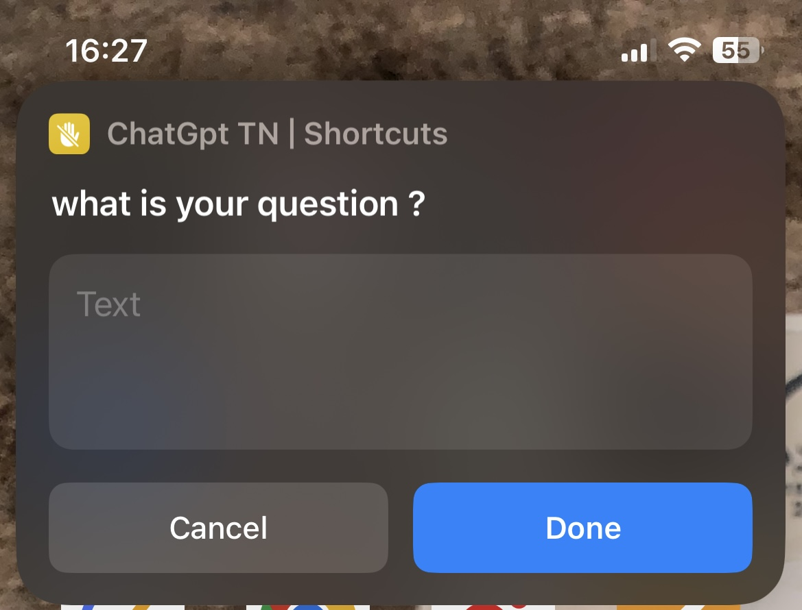
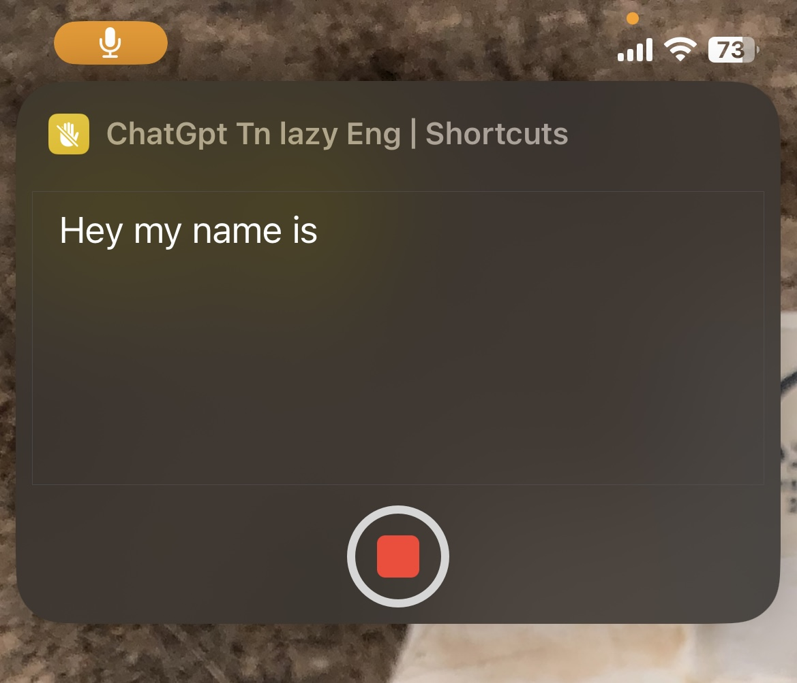
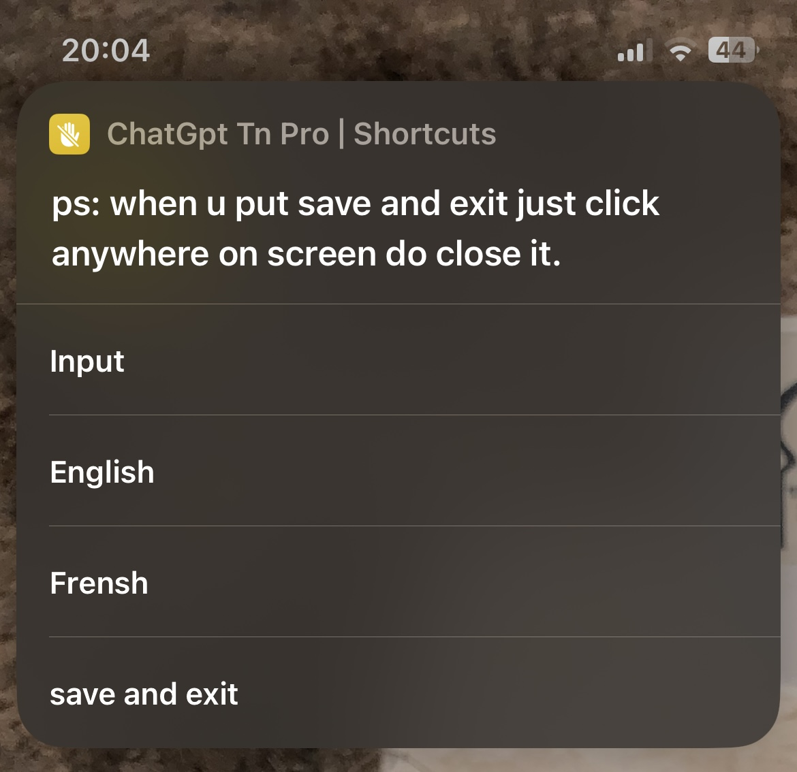

# Chatgpt-TN-Pro
Chatgpt tn pro without login 100% free

<h1 align="center">Hi 👋, I'm Hakim ben hadj brahim</h1>

<h3 align="left">Connect with me:</h3>

# ChatGPT TN Pro

## Features
We are pleased to announce the release of our new and improved shortcut,   which now allows users to write or use voice commands in both French and English. Our shortcut has been powered by OpenAI's API, and we are grateful for their contributions that have enabled us to further increase user productivity. 
By combining all these features into a single application, users can quickly get the most out of their communication with efficiency and speed.
We invite you to take advantage of this new version now and explore the enhanced features it has to offer.

## Update:
## V3
Hello everyone! 

We've decided to make a final change to our shortcut, as the cost associated with using our API has become too much. We are sad to announce that this means we will no longer be using our API in the shortcut, however it is still available for use. To ensure you can continue to use this shortcut, we have added some instructions on how to use your own API instead. 

We'd like to thank you all for understanding and we look forward to working with you all again on more projects in the future. Thank you!

## ⚙️ Steps:
Step 1: Open https://beta.openai.com/account/api-keys

Step 2: Log in to your account. 

Step 3: Create your own API key and copy it.

Step 4: Open the shortcut and paste in your API key (If this is the first time opening the shortcut, you can paste it directly). 

Step 5: Enjoy and see you soon!

 ## 💡 Informations:

Remember, if you have a free OpenAI account they will provide 18$ of usage over the course of 3 months - after that period is over a credit card must be used to continue using the service. 

## 🚀 About Me
My name is Hakim ben hadj brahim  I am a student in Issat Mateur and I would like to share my project with others who could benefit from it. This project is designed to provide a much-needed service in life, and I am confident it can make a lasting impact.
 
## 🔗 Links

# Screenshots []
  
  
  
  
  
## Authors

- [@Hakimbhb](https://www.github.com/hakimbhb)

## Link to Download

https://routinehub.co/shortcut/14106/
